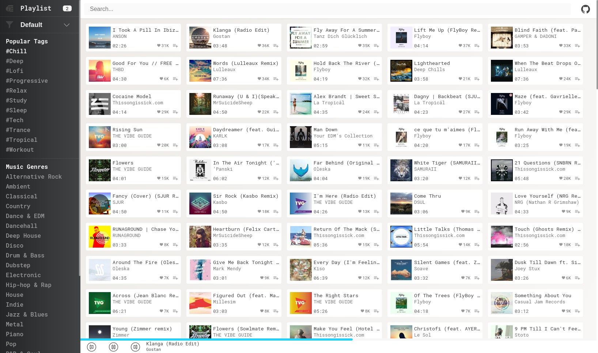

# Yet Another SoundCloud Client

See this application live at: [here](http://carlosqsilva.github.io/YASCC)

This application was bootstraped using [create-react-app](https://github.com/facebook/create-react-app), but instead of React was used [Preact](https://github.com/developit/preact/) A 3kb React alternative that works with the same ES6 API, together with [preact-compat](https://github.com/developit/preact-compat) a React compatibility layer for Preact. Also uses:

* Redux + Redux-thunk, to manage the application state and api calls.
* Redux-persist, to persist user created playlist to localstorage.
* [Styled-components](https://github.com/styled-components) because why not 😎.

This application also can be considered a PWA(Progressive Web App) by using Service Worker to cache its assets and allow to be saved to the homescreen. Also...

* [Media Session API](https://developer.mozilla.org/en-US/docs/Web/API/Media_Session_API) to give a nice integration with android smartphones.

## Todo

* [x] Highlight the current music card.
* [ ] Add nice transitions between routes.
* [ ] Make it controllable by keyboard.
* [ ] Add a dark mode.
* [ ] Write tests.

## Contributions

Feel free to submit pull requests, create issues or spread the word

# License

[MIT License](./LICENSE) © [Carlos Silva](carloseng.com)
